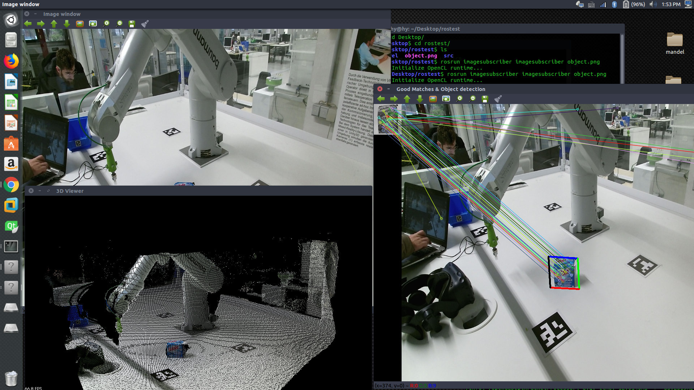
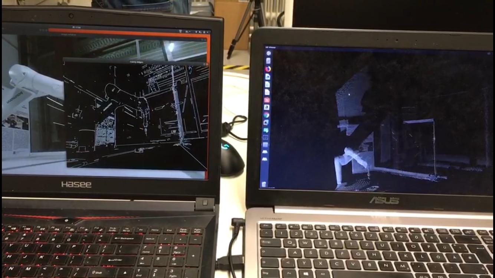

# project thesis
This repository is a container of my project thesis, it contains three stand-alone projects:VisandPub, calibration and imagesubscriber.  

## project overview
The VisandPub project is responsible for receiving visual data(color and depth information) from a Kinect v2 camera and visualizing them in form of point cloud,it also publishes visual data in form of ROS topics. The calibration project calibrates the extrinsic and intrinsic parameters of the utilized camera with a chessboard pattern of size 7x9, the imagesubscriber project runs in another ROS node to subscribe the topics published by the VisandPub project and then runs the [SURF](https://www.vision.ee.ethz.ch/~surf/eccv06.pdf) algorithm for object detection.

The following third-party libraies are needed to compile and execute those projects:
- [OpenCV](https://github.com/opencv/opencv/tree/3.2.0)(version 3.2.0, both normal and contrib module)
- [PCL](https://github.com/PointCloudLibrary/pcl/tree/pcl-1.8.0)(version 1.8.0, mainly for visualization purpose)
- [ROS](http://wiki.ros.org/Documentation)(kinect distribution, for communication )
- [libfreenect2](https://github.com/OpenKinect/libfreenect2/tree/v0.2.0)(driver for kinect v2 camera )

## Build instrucitons
Build instructions for the above mentioned libraries can be found on their individual documentation pages. To build those projects themselves, just follow the typical workflow of building a ros package(i.e. catkin_make or catkin build). As ROS is highly dependent on the Linux operating sysstem, those projects are only tetsed on the Linux plattform, Ubuntu 16.04 LTS specifically.

## Some demo pictures
This picture shows the visualization of point cloud and object detection in two ROS nodes on a single computer.

This picture shows edge detection and visualization of point cloud in two ROS nodes on two computers that under same local network.
